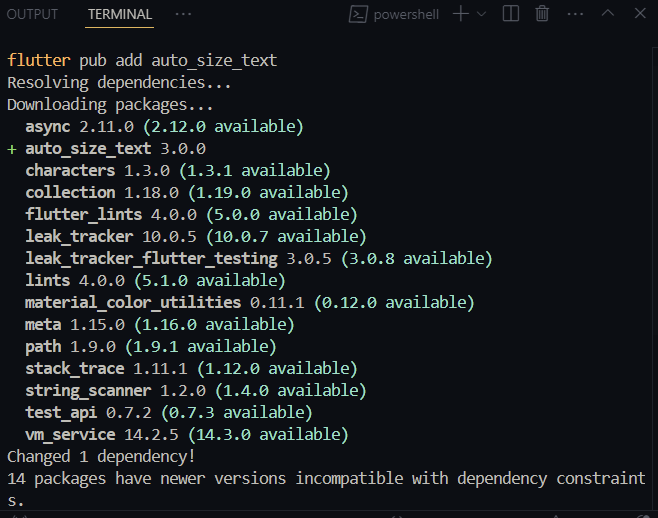
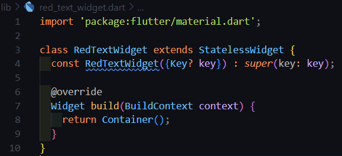
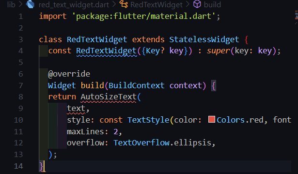
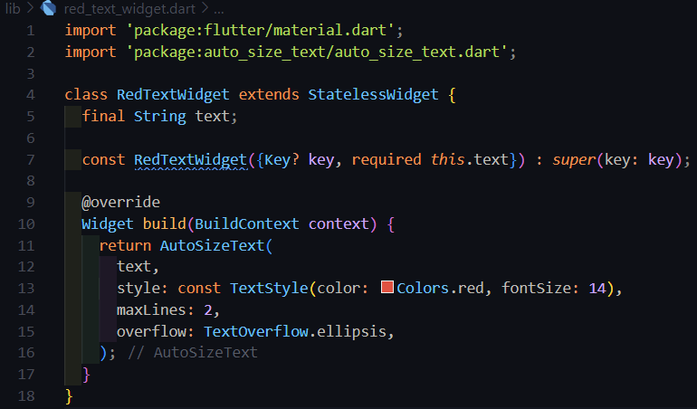
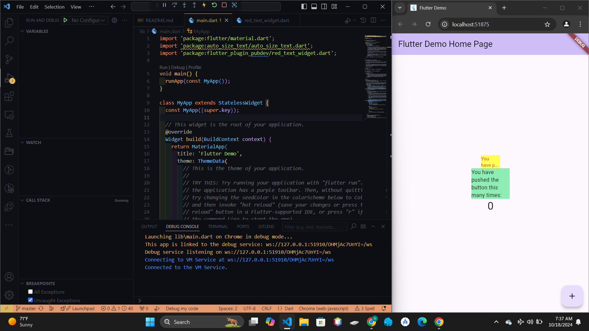

# **Manajemen Plugin**

#### Sukma Bagus Wahasdwika
#### 2241720223

## **Praktikum Menerapkan Plugin di Project Flutter**

**Langkah 1: Buat Project Baru**

Buatlah sebuah project flutter baru dengan nama flutter_plugin_pubdev. Lalu jadikan repository di GitHub Anda dengan nama flutter_plugin_pubdev.

**Langkah 2: Menambahkan plugin**

Tambahkan plugin auto_size_text menggunakan perintah berikut di terminal

**Langkah 3: Buat file red_text_widget.dart**

Buat file baru bernama red_text_widget.dart di dalam folder lib lalu isi kode seperti berikut.

**Langkah 4: Tambah Widget AutoSizeText**

Masih di file red_text_widget.dart, untuk menggunakan plugin auto_size_text, ubahlah kode return Container() menjadi seperti berikut.

**Langkah 5: Buat Variabel text dan parameter di constructor**

Tambahkan variabel text dan parameter di constructor seperti berikut.

**Langkah 6: Tambahkan widget di main.dart**

Buka file main.dart lalu tambahkan di dalam children: pada class _MyHomePageState

Run aplikasi tersebut dengan tekan F5, maka hasilnya akan seperti berikut.

## **Tugas Praktikum**

1. Selesaikan Praktikum tersebut, lalu dokumentasikan dan push ke repository Anda berupa screenshot hasil pekerjaan beserta penjelasannya di file README.md!

2. Jelaskan maksud dari langkah 2 pada praktikum tersebut!
    * Perintah flutter pub add auto_size_text digunakan untuk menambahkan paket auto_size_text ke proyek Flutter. Paket ini berguna untuk membuat widget teks yang secara otomatis menyesuaikan ukuran font agar sesuai dengan ruang yang tersedia, sehingga teks tidak terpotong atau melebihi batas widget.

3. Jelaskan maksud dari langkah 5 pada praktikum tersebut!
    * Kode tersebut adalah konstruktor dari widget Flutter bernama RedTextWidget, yang menerima teks sebagai parameter. Konstruktor ini untuk widget yang membutuhkan input teks, dengan parameter text yang wajib diisi dan memungkinkan widget bersifat konstan.

4. Pada langkah 6 terdapat dua widget yang ditambahkan, jelaskan fungsi dan perbedaannya!
    1. Container Pertama
    Fungsi:
    - Membuat sebuah Container dengan latar belakang berwarna kuning (yellowAccent).
    - Memiliki lebar sebesar 50 piksel. 
    - Di dalamnya terdapat widget RedTextWidget yang menampilkan teks 'You have pushed the button this many times:'.
    2. Container Kedua
    Fungsi:
    - Membuat sebuah Container dengan latar belakang berwarna hijau (greenAccent).
    - Memiliki lebar sebesar 100 piksel.
    - Di dalamnya terdapat widget Text yang menampilkan teks 'You have pushed the button this many times:' dengan gaya teks standar (tanpa modifikasi tambahan).
    * Perbedaan Utama:
    Widget yang Digunakan
        - Container pertama menggunakan RedTextWidget, yang merupakan widget kustom. Meskipun detailnya tidak ditampilkan di sini, widget ini bisa memiliki gaya atau perilaku khusus, seperti teks berwarna merah.
        - Container kedua menggunakan widget Text bawaan Flutter, yang hanya menampilkan teks biasa tanpa perubahan gaya tambahan.
        
5. Jelaskan maksud dari tiap parameter yang ada di dalam plugin auto_size_text berdasarkan tautan pada dokumentasi ini !\
    * AutoSizeText digunakan untuk menyesuaikan ukuran font teks secara otomatis agar sesuai dengan ruang yang tersedia, sehingga mencegah teks terpotong atau melampaui batas widget.
        - maxLines: Menentukan jumlah maksimum baris teks yang ditampilkan. Jika teks terlalu panjang, ukuran font akan diperkecil hingga sesuai.
        - minFontSize & maxFontSize: Menentukan ukuran minimum dan maksimum font yang diizinkan untuk penyesuaian teks.
        - group: AutoSizeTextGroup memungkinkan beberapa AutoSizeText memiliki ukuran font yang seragam.
        - stepGranularity: Mengatur langkah perubahan ukuran font, dengan nilai default 1 (perubahan 1 unit).
        - presetFontSizes: Menyediakan daftar ukuran font yang dapat dipilih otomatis, memberi kontrol lebih pada ukuran font.
        - overflowReplacement: Menyediakan alternatif tampilan jika teks tidak muat dalam ruang yang tersedia.
        - Rich Text: Mendukung RichText untuk gaya dan format teks yang kompleks.

    * Parameter Lainnya AutoSizeText menerima parameter serupa dengan Text, seperti style untuk gaya teks, textAlign untuk perataan, dan softWrap untuk pembungkusan otomatis.
    * Performa Karena perhitungan ukuran font yang dinamis, AutoSizeText mungkin sedikit lebih lambat saat render pertama, namun dampaknya minimal.
    * Troubleshooting
        - Missing bounds: AutoSizeText memerlukan batas ukuran yang jelas, seperti Container, SizedBox, atau Expanded.
        - MinFontSize terlalu besar: Pastikan minFontSize cukup kecil agar teks muat dalam ruang yang disediakan.

6. Kumpulkan laporan praktikum Anda berupa link repository GitHub kepada dosen!

https://github.com/bagusswahasdwikaa/flutter_plugin_pubdev  
